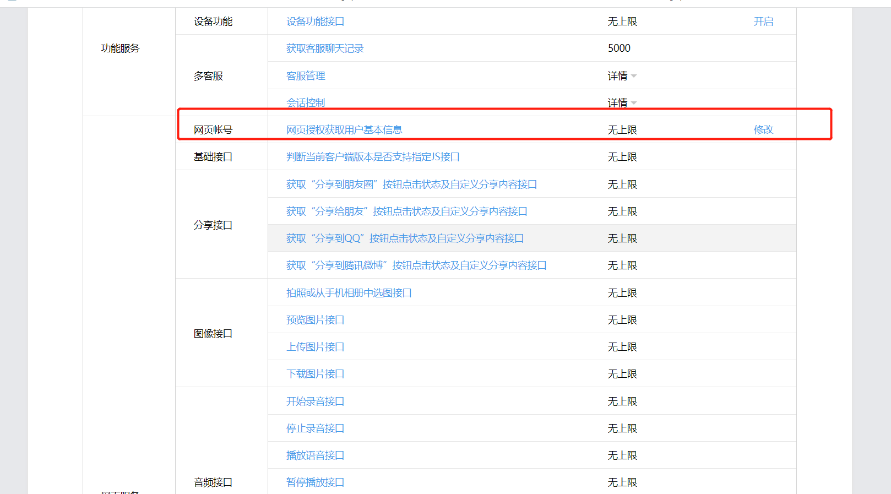
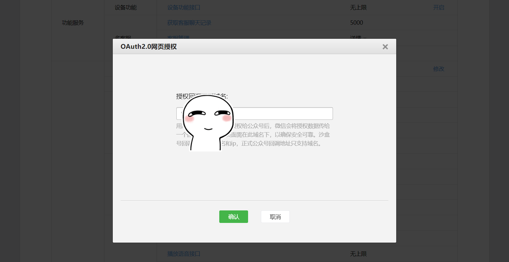
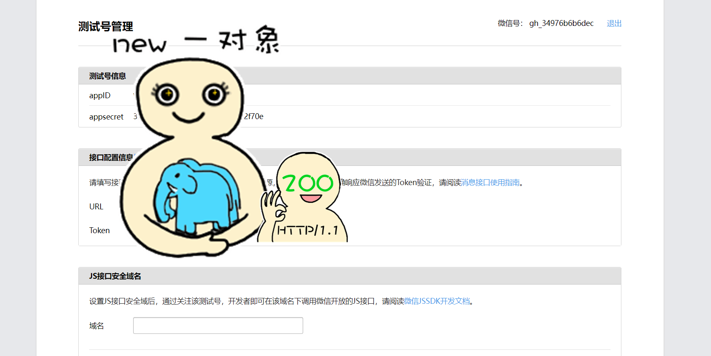

# 一. [OAuth2.0](oauth2/src/main/java/com/zjut/study/auth/oauth2)
在spring中测试OAuth2.0等第三方平台网页授权，当前已经做了的网页授权有:   

## 1.1 微信公众号平台网页授权:
微信公众号平台网页授权相关链接是在微信环境中流转完成的   
微信的OAuth2.0网页授权经过如下几步:
+ step.1 公众号后台配置-  
[公众号后台](https://mp.weixin.qq.com/debug/cgi-bin/sandboxinfo?action=showinfo&t=sandbox/index)  
   

+ step.2 配置微信授权平台和服务器间的签名校验   
`/oauth/2.0/signature/check`接口中做的授权平台和服务器间的签名校验   
   

+ step.3 网页(如登录页面)中请求第三方登录   
`/oauth/2.0/call/{thirdParty}`(登录页面)点击发送登录请求，接口内引导用户到授权确认微信页面

+ step.4 用户授权确认后回传临时code并获取token及用户信息    
`/oauth/2.0/invoke`该接口为微信公众号回传code及自定义组装参数接口，是step.3中拼接在引导用户确认链接中参数。获取到code后则可获取到token及唯一用户openID，通过这两个参数进一步获取用户详细信息   