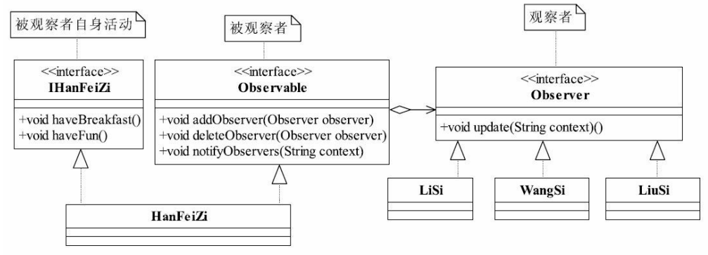

[toc]

# [一. 工厂模式](src/main/java/com/zjut/study/patterns/factory)

# [二. 代理模式](src/main/java/com/zjut/study/patterns/proxy)
## 2.1 静态代理
静态代理：由程序员创建或工具生成代理类的源码，再编译代理类。所谓静态也就是在程序运行前就已经存在代理类的字节码文件，代理类和委托类的关系在运行前就确定了。
动态代理：动态代理类的源码是在程序运行期间由JVM根据反射等机制动态的生成，所以不存在代理类的字节码文件。代理类和委托类的关系是在程序运行时确定。

## 2.2 JDK动态代理
通过javap对代理对象反编译后发现，该代理对象继承了Proxy类并实现了目标接口，所以JDK只能代理接口

## 2.3 CGLIB动态代理
CGLib采用的是用创建一个继承实现类的子类，用asm库动态修改子类的代码来实现的，所以可以用传入的类引用执行代理类

## 2.4 JDK、CGLIB区别
CGLib创建的动态代理对象性能比JDK创建的动态代理对象的性能高不少，但是CGLib在创建代理对象时所花费的时间却比JDK多得多，所以对于单例的对象，因为无需频繁创建对象，用CGLib合适，反之，使用JDK方式要更为合适一些。同时，由于CGLib由于是采用动态创建子类的方法，对于final方法，无法进行代理

# [三. 观察者模式](src/main/java/com/zjut/study/patterns/observer)  
  
