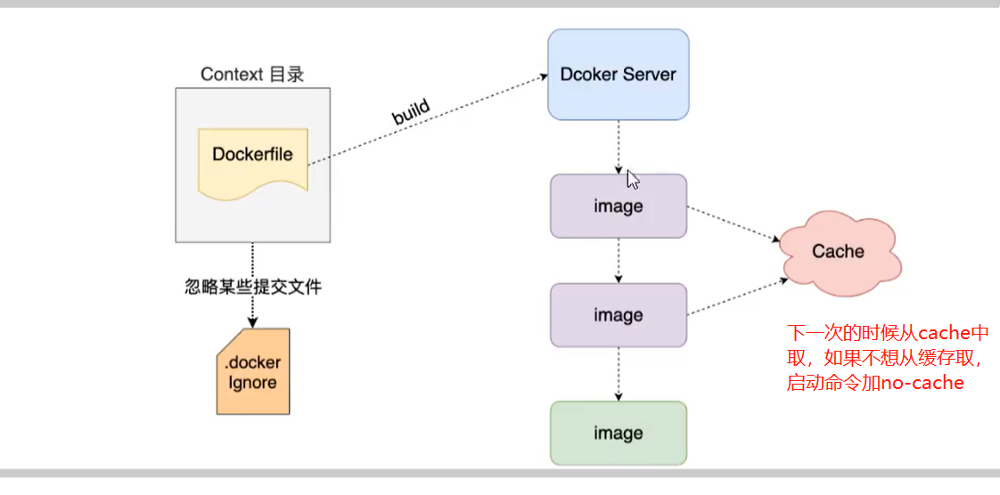

# 一. docker原理
  

# 二. dockerfile说明

+ **CMD和ENTRYPOINT区别**      
  CMD指令可以指定容器启动时要执行的命令，但它可以被docker run命令的参数覆盖掉。可做变量接受。  
  ENTRYPOINT指令也可指定容器启动时要执行的命令。如果dockerfile中也有CMD指令，CMD中的参数会被附加到ENTRYPOINT 指令的后面。 如果这时docker run命令带了参数，这个参数会覆盖掉CMD指令的参数，并也会附加到ENTRYPOINT 指令的后面。       
  MD指令和ENTRYPOINT指令当中可以使用JSON格式或者SHELL形式书写内容，但是CMD指令结合ENTRYPOINT指令使用必须是JSON格式，不然是生效的。
