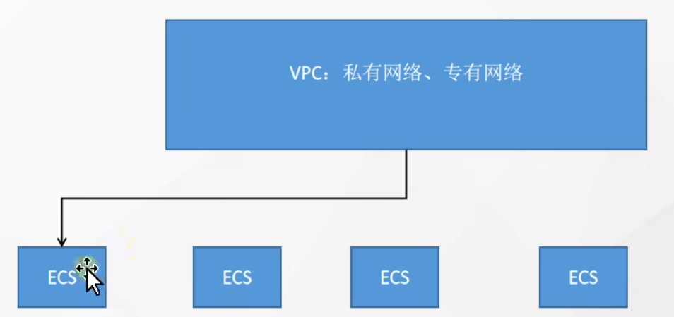
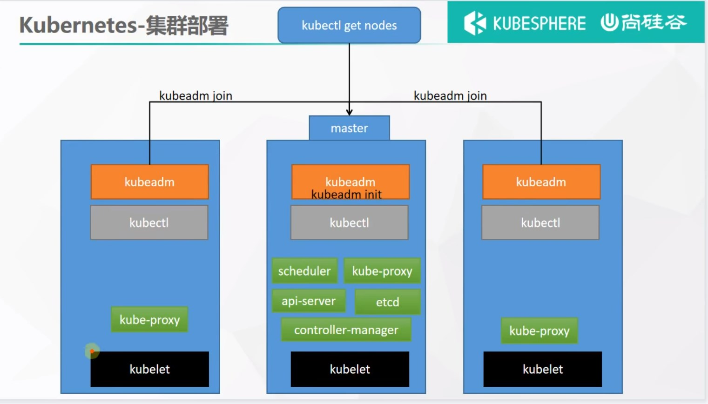
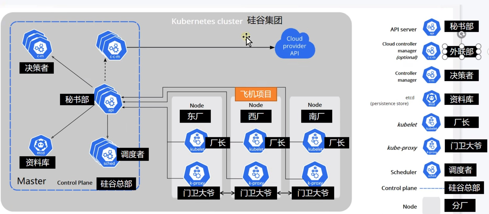

# 一. k8s部署
## 1.1 概念
### 1.1.1 VPC(私有网络、专有网络)

#### 1.1.1.1 概念说明
安装K8S集群安装时会涉及到三个网段：
+ 宿主机网段：就是安装k8s的服务器
+ Pod网段：k8s Pod的网段，相当于容器的IP
+ Service网段：k8s service网段，service用于集群容器通信

针对阿里云(其他厂商类似)
+ 专有网络VPC: 指定服务器所在的网段范围，在这下面还可以创建交换机，在该网段下面再细化一个网段

## 1.2 部署安装
  
kubelet: 厂长  
kubectl: 命令管理  
kubeadm: 引导创建集群  

# 二. 基础概念
kubernetes具有以下特性：
+ **服务发现和负载均衡**  
   Kubernetes 可以使用 DNS(内部) 名称或自己的 IP 地址公开容器，如果进入容器的流量很大， Kubernetes 可以负载均衡并分配网络流量，从而使部署稳定。
+ **存储编排**  
   Kubernetes 允许你自动挂载你选择的存储系统，例如本地存储、公共云提供商等。
+ **自动部署和回滚**  
   可以使用 Kubernetes 描述已部署容器的所需状态，它可以以受控的速率将实际状态 更改为期望状态。例如，自动化 Kubernetes 来部署创建新容器， 删除现有容器并将它们的所有资源用于新容器。
+ **自动完成装箱计算**
  Kubernetes 允许指定每个容器所需 CPU 和内存（RAM）。 当容器指定了资源请求时，Kubernetes 可以做出更好的决策来管理容器的资源。
+ **自我修复**   
   Kubernetes 重新启动失败的容器、替换容器、杀死不响应用户定义的 运行状况检查的容器，并且在准备好服务之前不将其通告给客户端。
+ **密钥与配置管理**   
   Kubernetes 存储和管理敏感信息，例如密码、OAuth 令牌和 ssh 密钥。 可以在不重建容器镜像的情况下部署和更新密钥和应用程序配置，也无需在堆栈配置中暴露密钥。

# 三. 原理
## 3.1 架构
组件架构关系如下：


### 1、控制平面组件（Control Plane Components）
控制平面的组件对集群做出全局决策(比如调度)，以及检测和响应集群事件（例如，当不满足部署的 replicas 字段时，启动新的 pod）。
控制平面组件可以在集群中的任何节点上运行。 然而，为了简单起见，设置脚本通常会在同一个计算机上启动所有控制平面组件， 并且不会在此计算机上运行用户容器。 请参阅使用 kubeadm 构建高可用性集群 中关于多 VM 控制平面设置的示例。     

**kube-apiserver**  
API 服务器是 Kubernetes 控制面的组件， 该组件公开了 Kubernetes API。 API 服务器是 Kubernetes 控制面的前端。
Kubernetes API 服务器的主要实现是 kube-apiserver。 kube-apiserver 设计上考虑了水平伸缩，也就是说，它可通过部署多个实例进行伸缩。 你可以运行 kube-apiserver 的多个实例，并在这些实例之间平衡流量。

**etcd**  
etcd 是兼具一致性和高可用性的键值数据库，可以作为保存 Kubernetes 所有集群数据的后台数据库。
您的 Kubernetes 集群的 etcd 数据库通常需要有个备份计划。
要了解 etcd 更深层次的信息，请参考 etcd 文档。

**kube-scheduler**  
控制平面组件，负责监视新创建的、未指定运行节点（node）的 Pods，选择节点让 Pod 在上面运行。
调度决策考虑的因素包括单个 Pod 和 Pod 集合的资源需求、硬件/软件/策略约束、亲和性和反亲和性规范、数据位置、工作负载间的干扰和最后时限。

**kube-controller-manager**  
在主节点上运行 控制器 的组件。
从逻辑上讲，每个控制器都是一个单独的进程， 但是为了降低复杂性，它们都被编译到同一个可执行文件，并在一个进程中运行。
这些控制器包括:
+ 节点控制器（Node Controller）: 负责在节点出现故障时进行通知和响应
+ 任务控制器（Job controller）: 监测代表一次性任务的 Job 对象，然后创建 Pods 来运行这些任务直至完成
+ 端点控制器（Endpoints Controller）: 填充端点(Endpoints)对象(即加入 Service 与 Pod)
+ 服务帐户和令牌控制器（Service Account & Token Controllers）: 为新的命名空间创建默认帐户和 API 访问令牌

**cloud-controller-manager**  
云控制器管理器是指嵌入特定云的控制逻辑的 控制平面组件。 云控制器管理器允许您链接集群到云提供商的应用编程接口中， 并把和该云平台交互的组件与只和您的集群交互的组件分离开。
cloud-controller-manager 仅运行特定于云平台的控制回路。 如果你在自己的环境中运行 Kubernetes，或者在本地计算机中运行学习环境， 所部署的环境中不需要云控制器管理器。
与 kube-controller-manager 类似，cloud-controller-manager 将若干逻辑上独立的 控制回路组合到同一个可执行文件中，供你以同一进程的方式运行。 你可以对其执行水平扩容（运行不止一个副本）以提升性能或者增强容错能力。     
下面的控制器都包含对云平台驱动的依赖：
+ 节点控制器（Node Controller）: 用于在节点终止响应后检查云提供商以确定节点是否已被删除
+ 路由控制器（Route Controller）: 用于在底层云基础架构中设置路由
+ 服务控制器（Service Controller）: 用于创建、更新和删除云提供商负载均衡器

### 2、Node 组件
节点组件在每个节点上运行，维护运行的 Pod 并提供 Kubernetes 运行环境。    
kubelet
一个在集群中每个节点（node）上运行的代理。 它保证容器（containers）都 运行在 Pod 中。
kubelet 接收一组通过各类机制提供给它的 PodSpecs，确保这些 PodSpecs 中描述的容器处于运行状态且健康。 kubelet 不会管理不是由 Kubernetes 创建的容器。
kube-proxy
kube-proxy 是集群中每个节点上运行的网络代理， 实现 Kubernetes 服务（Service） 概念的一部分。
kube-proxy 维护节点上的网络规则。这些网络规则允许从集群内部或外部的网络会话与 Pod 进行网络通信。
如果操作系统提供了数据包过滤层并可用的话，kube-proxy 会通过它来实现网络规则。否则， kube-proxy 仅转发流量本身。


# 四. 实战
## 4.1 Namespace 
名称空间用来隔离资源
```
kubectl create ns hello
kubectl delete ns hello
```
通过yaml创建
```yaml
apiVersion: v1
kind: Namespace
metadata:
  name: hello
```

## 4.2 Pod
运行中的一组容器，Pod是kubernetes中应用的最小单位.
```
# 创建pod,默认是创建在default空间
kubectl run mynginx --image=nginx

# 查看default名称空间的Pod
kubectl get pod 
# 描述
kubectl describe pod 你自己的Pod名字
# 删除
kubectl delete pod Pod名字
# 查看Pod的运行日志
kubectl logs Pod名字
kubectl logs -f Pod名字 # 日志追踪

# 每个Pod - k8s都会分配一个ip
kubectl get pod -owide
# 使用Pod的ip+pod里面运行容器的端口
curl 192.168.169.136

# 集群中的任意一个机器以及任意的应用都能通过Pod分配的ip来访问这个Pod
```

pod中但容器的
```yaml
apiVersion: v1
kind: Pod
metadata:
  labels:
    run: mynginx
  name: mynginx # pod的名称
#  namespace: default
spec:
  containers:
  - image: nginx
    name: mynginx # 容器的名称
```

pod中多容器的,一个pod一个ip,通过端口访问到不同的容器，如，pod内有nginx和tomcat，80访问到nginx，8080访问到tomcat。pod内的容器间通过localhost加端口相互访问。
如果要在同一个pod中部署多个容器，需要暴露的端口不一致，否则后面的容器起不来，如果端口一定要一致则需要将容器放在不同的network网络空间
```yaml
apiVersion: v1
kind: Pod
metadata:
  labels:
    run: myapp
  name: myapp
spec:
  containers:
  - image: nginx
    name: nginx
  - image: tomcat:8.5.68
    name: tomcat
```
**此时的应用还不能外部访问**

## 4.2 Deployment
控制Pod，使Pod拥有多副本，自愈，扩缩容等能力。使用`kubectl delete pod xxx`删除pod,run启动的会直接删掉，但是create deployment启动的pod会被删掉，但是会重新再启动一个。
```
# 清除所有Pod，比较下面两个命令有何不同效果？
kubectl run mynginx --image=nginx
# 上面是启动一个pod,如果要启动多个副本，则需要运行多次

# 创建一个pod或者创建pod时启动多个副本
kubectl create deployment mytomcat --image=tomcat:8.5.68
kubectl create deployment my-dep --image=nginx --replicas=3

# 动态的伸缩或扩容,或通过edit的方式修改yaml文件配置
kubectl scale --replicas=5 deployment/my-dep
kubectl edit deployment my-dep

# 滚动更新
# 语法：kubectl set image 工作负载方式/Pod名称 镜像名称=需要调整的镜像 --record
# --record 用作记录滚动更新的信息， 后面方便版本回退
kubectl set image deployment/my-dep nginx=nginx:1.16.1 --record
# 修改yaml文件的方式
kubectl edit deployment/my-dep

# 版本回退
#历史记录
kubectl rollout history deployment/my-dep
#查看某个历史详情
kubectl rollout history deployment/my-dep --revision=2
#回滚(回到上次)
kubectl rollout undo deployment/my-dep
#回滚(回到指定版本)
kubectl rollout undo deployment/my-dep --to-revision=2
```
yaml方式创建
```yaml
apiVersion: apps/v1
kind: Deployment
metadata:
  labels:
    app: my-dep
  name: my-dep
spec:
  replicas: 3
  selector:
    matchLabels:
      app: my-dep
  template:
    metadata:
      labels:
        app: my-dep
    spec:
      containers:
      - image: nginx
        name: nginx
```

更多：
除了Deployment，k8s还有 StatefulSet 、DaemonSet 、Job  等 类型资源。我们都称为 工作负载。
有状态应用使用  StatefulSet  部署，无状态应用使用 Deployment 部署
https://kubernetes.io/zh/docs/concepts/workloads/controllers/

```
Deployment:无状态应用部署，比如微服务，提供多副本等功能
StatefulSet:有状态应用部署，比如redis，提供稳定的存储、网络等功能
DaemonSet:守护型应用部署，比如日志收集组件，在每个机器都运行一份
Job/CronJob: 定时任务部署， 比如垃圾清理组件，可以在指定时间运行
```

# 4.3 Service
将一组 Pods 公开为网络服务的抽象方法。pod的服务发现与负载均衡  

**ClusterIP方式：**
```
#暴露Deploy，默认是使用集群IP的方式，只能在宿主机或者集群其他pod中访问
# 可以通过IP方式：curl 10.96.20.78:8000
# 可以通过 servicename.namespace.svc:port (curl my-dep.default.svc:8000) 方式访问，此种方式不能在宿主机访问，只能在集群其他pod中访问
kubectl expose deployment my-dep --port=8000 --target-port=80
kubectl expose deployment my-dep --port=8000 --target-port=80 --type=ClusterIP
#使用标签检索Pod
kubectl get pod -l app=my-dep
```
通过yaml方式部署service
```yaml
apiVersion: v1
kind: Service
metadata:
  labels:
    app: my-dep 
  name: my-dep
spec:
  selector:
    app: my-dep # 所有能访问的pod共用的一个标签
  ports:
  - port: 8000 # service暴露的端口
    protocol: TCP 
    targetPort: 80 # pod的端口
# type: ClusterIP # 默认集群IP的方式
```

**NodePort方式：**
```
kubectl expose deployment my-dep --port=8000 --target-port=80 --type=NodePort
```
通过yaml方式
```yaml
apiVersion: v1
kind: Service
metadata:
  labels:
    app: my-dep
  name: my-dep
spec:
  ports:
  - port: 8000 # service端口
    protocol: TCP
    targetPort: 80 # pod端口
  selector:
    app: my-dep
  type: NodePort
```
NodePort范围在 30000-32767 之间   
NodePort的service除了自身的端口外还会随机的开一个对外暴露的端口，这个端口在每个服务器上都会打开，所以通过任意一个服务器的端口都能访问到这个service    
service自身的端口只能用service的IP在集群内访问，外网可以用公网IP加上暴露端口访问

# 4.4 Ingress