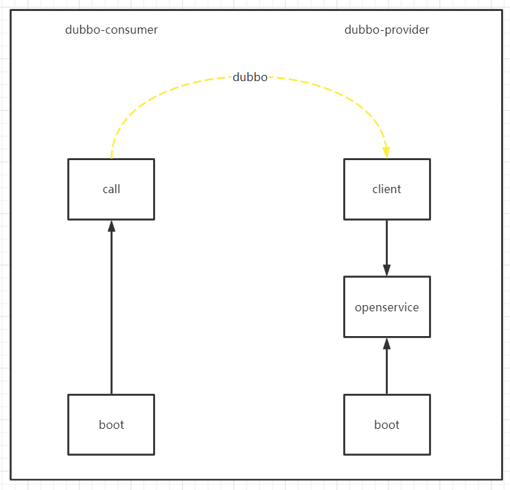

# 一. 服务结构说明
只是dubbo的相关功能，故只是注册了dubbo接口，也没有用配置中心，也没有注册应用到注册中心

## 1.1 基本信息
```
提供者: dubbo-provider
消费者: dubbo-consumer
注册中心: nacos
```
**模块间架构关系如下:**  


**各模块主要功能**  
```
boot: 根模块，启动模块
biz: 业务功能模块
client: 客户端模块,提供给调用方的包，内部最好不要有任何第三方依赖，避免调用方依赖后导致包冲突
openservice: 提供者提供的dubbo接口功能实现
call: 调用者请求模块
```

## 1.2 整合过程说明
依赖jar包如下
```
<dependency>
    <artifactId>dubbo</artifactId>
    <groupId>org.apache.dubbo</groupId>
</dependency>
<dependency>
    <artifactId>nacos-discovery-spring-boot-starter</artifactId>
    <groupId>com.alibaba.boot</groupId>
</dependency>
```
application.properties、启动参数、配置中心中配置服务发现相关配置参数：
```
nacos.discovery.server-addr = 127.0.0.1:8848
nacos.discovery.namespace = 
```
剩下一些dubbo的配置bean和扫描注解之类

## 1.3 当前有疑问的点
+ 将当前应用注册到nacos中时一定需要`NacosRegisterConfiguration`代码注入么
+ 将dubbo包扫描替换成代码方式
