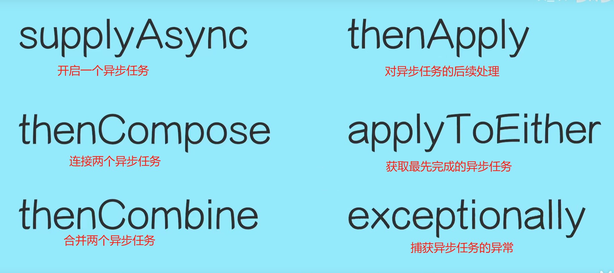
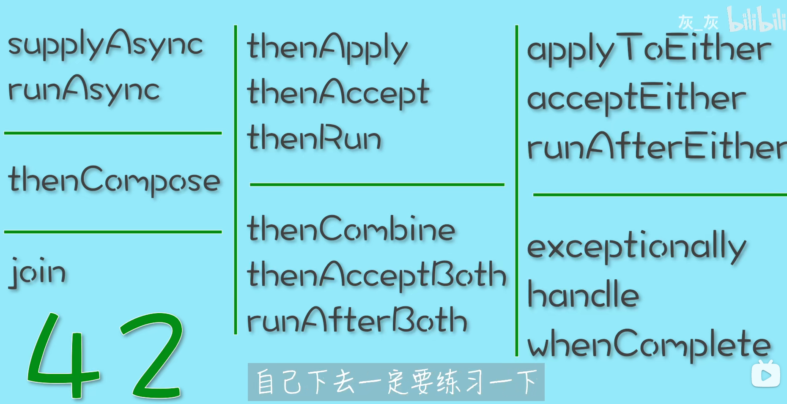

# 一. CompletableFuture

  

`锁相关的暂时先放在这里，等后面再看是不是要放出去单独起一个模块`
# [二. AQS](src/main/java/com/zjut/study/juc/lock)


# 二. 多线程或线程池的参数传递
案例： traceId的传递方案
+ 1.重写线程池execute
```java
class MDCAwareThreadPool extends ThreadPoolExecutor {
    @Override
    public void execute(Runnable command) {
        Map<String, String> context = MDC.getCopyOfContextMap(); // 捕获父线程上下文
        super.execute(() -> {
            MDC.setContextMap(context);    // 设置到子线程
            try {
                command.run();
            } finally {
                MDC.clear();                // 清理上下文
            }
        });
    }
}
```
+ 2.spring任务池添加TaskDecorator
```java
public class ContextCopyingDecorator implements TaskDecorator {
    @Override
    public Runnable decorate(Runnable runnable) {
        Map<String, String> context = MDC.getCopyOfContextMap();
        return () -> {
            MDC.setContextMap(context);    // 设置子线程上下文
            try {
                runnable.run();
            } finally {
                MDC.clear();               // 清理
            }
        };
    }
}

// 配置线程池
@Bean
public TaskExecutor taskExecutor() {
    ThreadPoolTaskExecutor executor = new ThreadPoolTaskExecutor();
    executor.setTaskDecorator(new ContextCopyingDecorator());
    return executor;
}
```
+ 3.使用阿里的TransmittableThreadLocal
```java
// 使用TTL替换ThreadLocal
private static TransmittableThreadLocal<String> traceIdHolder = new TransmittableThreadLocal<>();

// 提交任务时使用TtlRunnable包装
executor.execute(TtlRunnable.get(() -> {
    System.out.println(traceIdHolder.get()); // 正确获取TraceId
}));
```
+ 4.集成分布式追踪框架（生产级方案）
  如SkyWalking、Zipkin等框架自动处理TraceId传递：
  - 实现原理：通过Java Agent字节码增强或埋点SDK，在异步调用边界自动注入和提取TraceId。
  - 示例（SkyWalking Agent）：
  - 配置-javaagent:/path/to/skywalking-agent.jar，框架自动拦截线程池提交操作传递上下文。
  - 优点：零代码侵入，支持跨服务、跨线程、MQ等复杂场景。
  - 缺点：增加系统复杂度，依赖外部组件。
