# 一. 原理
## 1.1 报文
[报文详细说明文档](https://mcxiaoke.gitbooks.io/mqtt-cn/content/mqtt/01-Introduction.html)     

[报文介绍比较好的视频](https://www.bilibili.com/video/BV1oJ411176Q/?p=1&vd_source=70eb1facbc8a6b0cc0b7b0efb3c281bc)
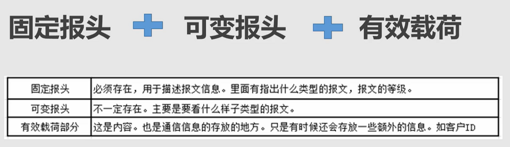   
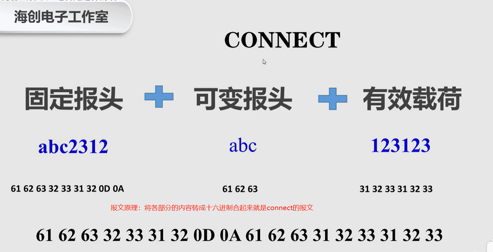  
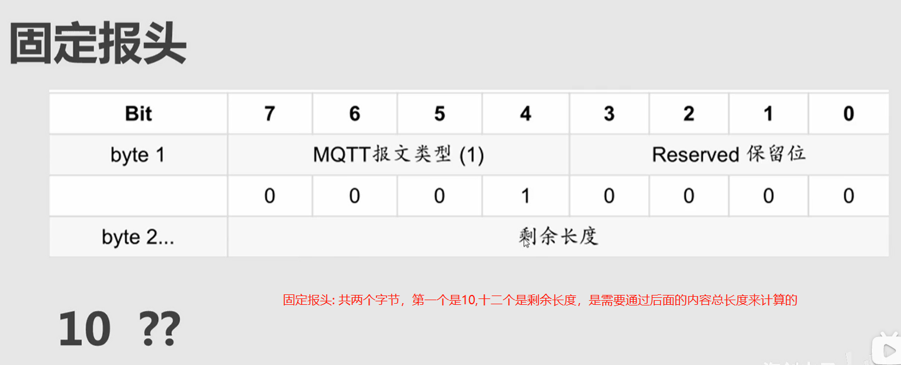    
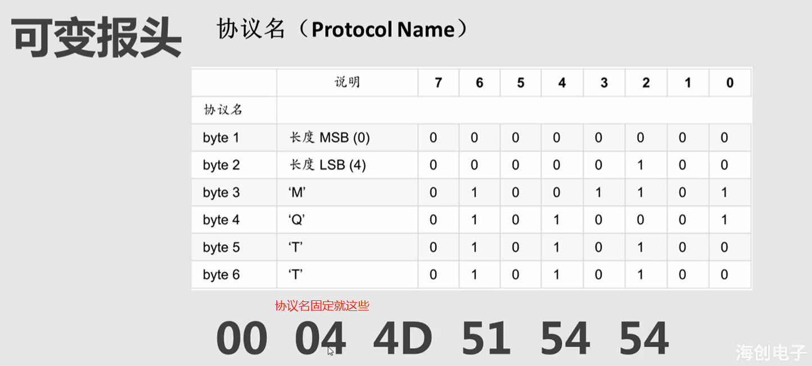   
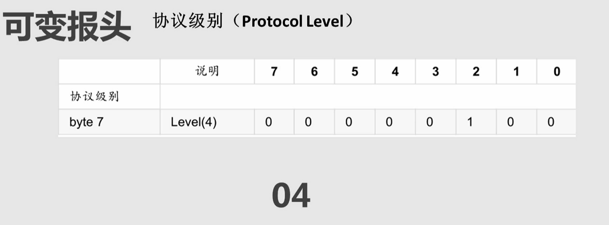   
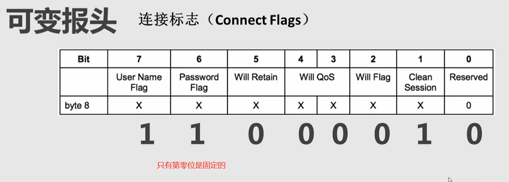   
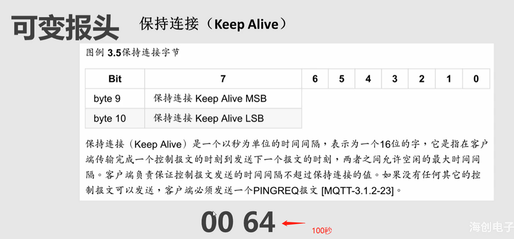    

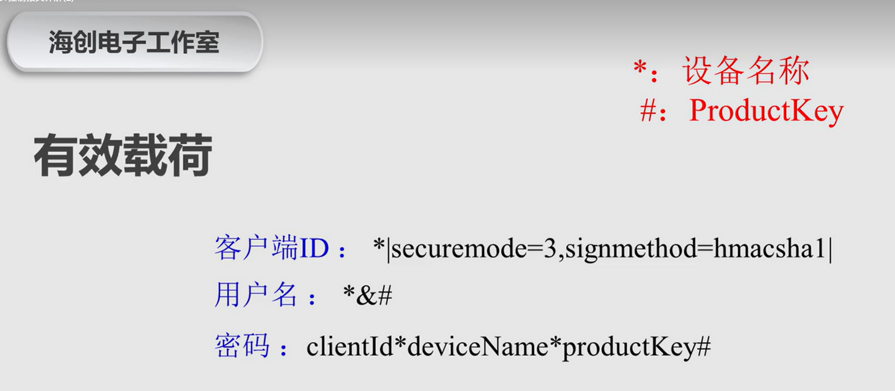   

### 1.1.1 connect
阿里云连接地址：iot-06z00fgrxhwetz7.mqtt.iothub.aliyuncs.com:1883

[connect连接博客](https://blog.csdn.net/daniaoxp/article/details/103039296)
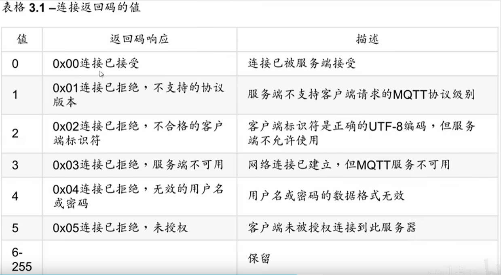

三要素
```json
{
  "ProductKey": "hm5wlky7r5G",
  "DeviceName": "ld0001",
  "DeviceSecret": "9bd11c83bcad652162be937c2c81b0f9"
}
```
请求报文拼接
```
固定报头的拼装：
	10 ??  (matt报文类型+保留位，固定的，问好是剩余长度，是可变报文加有效载荷的总长度)
	
可变报头的拼接：
	00 04 4D 51 54 54 04 C2 00 64  (协议名、用户密码、消息级别、保活时间等参数组装后的hex，共十个字节，基本固定)

有效载荷的拼装：
客户端id: ld0001|securemode=3,signmethod=hmacsha1|  
	转成十六进制：6C 64 30 30 30 31 7C 73 65 63 75 72 65 6D 6F 64 65 3D 33 2C 73 69 67 6E 6D 65 74 68 6F 64 3D 68 6D 61 63 73 68 61 31 7C  
	长度:40 长度的hex:0x28
	最终报文hex: 00 28 6C 64 30 30 30 31 7C 73 65 63 75 72 65 6D 6F 64 65 3D 33 2C 73 69 67 6E 6D 65 74 68 6F 64 3D 68 6D 61 63 73 68 61 31 7C  
用户名： ld0001&hm5wlky7r5G                        
	转成十六进制： 6C 64 30 30 30 31 26 68 6D 35 77 6C 6B 79 37 72 35 47             
	长度:18    长度的hex: 0x12
	最终报文hex: 00 12 6C 64 30 30 30 31 26 68 6D 35 77 6C 6B 79 37 72 35 47 
密码： clientIdld0001deviceNameld0001productKeyhm5wlky7r5G  sha1加密：7df55dfa3629a8c4a1bb8fe22a353e19c8e88da2
	转成十六进制：37 64 66 35 35 64 66 61 33 36 32 39 61 38 63 34 61 31 62 62 38 66 65 32 32 61 33 35 33 65 31 39 63 38 65 38 38 64 61 32     
	长度:40  长度的hex:0x28
	最终报文hex: 00 28 37 64 66 35 35 64 66 61 33 36 32 39 61 38 63 34 61 31 62 62 38 66 65 32 32 61 33 35 33 65 31 39 63 38 65 38 38 64 61 32  

最终拼接：
10 72 00 04 4D 51 54 54 04 C2 00 64 00 28 6C 64 30 30 30 31 7C 73 65 63 75 72 65 6D 6F 64 65 3D 33 2C 73 69 67 6E 6D 65 74 68 6F 64 3D 68 6D 61 63 73 68 61 31 7C 00 12 6C 64 30 30 30 31 26 68 6D 35 77 6C 6B 79 37 72 35 47 00 28 37 64 66 35 35 64 66 61 33 36 32 39 61 38 63 34 61 31 62 62 38 66 65 32 32 61 33 35 33 65 31 39 63 38 65 38 38 64 61 32
```

### 1.1.2 订阅主题和订阅确认
订阅主题：客户端向服务端发起订阅
```
固定报头的拼装：
	82 ??  (matt报文类型+保留位，固定的，问号是剩余长度，是可变报文加有效载荷的总长度)
	
可变报头的拼接：
	00 0A   (固定)

有效载荷的拼装：
	主题过滤器: /ota/device/upgrade/hm5wlky7r5G/ld0001   (订阅ota固件升级信息下行)
	转成十六进制：2F 6F 74 61 2F 64 65 76 69 63 65 2F 75 70 67 72 61 64 65 2F 68 6D 35 77 6C 6B 79 37 72 35 47 2F 6C 64 30 30 30 31 
	长度:38 长度的hex:0x26
	最终报文hex: 00 26 2F 6F 74 61 2F 64 65 76 69 63 65 2F 75 70 67 72 61 64 65 2F 68 6D 35 77 6C 6B 79 37 72 35 47 2F 6C 64 30 30 30 31 
	
	服务质量要求(QOS等级): 
	00 
	
最终拼接：
82 2B 00 0A 00 26 2F 6F 74 61 2F 64 65 76 69 63 65 2F 75 70 67 72 61 64 65 2F 68 6D 35 77 6C 6B 79 37 72 35 47 2F 6C 64 30 30 30 31 00
```

订阅确认：服务端返回客户端订阅结果
```
固定报头：
	90 ??
	
可变报头：
	00 0A (返回客户端订阅的可变报头)
	
有效载荷：
	01 (订阅的QOS等级,订阅QOS00和01返回的都是01)

最终返回订阅确认内容:
	90 03 00 0A 01
```

### 1.1.3 取消订阅主题和取消订阅确认
取消订阅
```
固定报头的拼装：
	A2 ??  (matt报文类型+保留位，固定的，问好是剩余长度，是可变报文加有效载荷的总长度)
	
可变报头的拼接：
	00 0A   (报文标识符，固定，和订阅主题的可变报头保持一致)

有效载荷的拼装：
	主题过滤器: /ota/device/upgrade/hm5wlky7r5G/ld0001   (订阅ota固件升级信息下行)
	转成十六进制：2F 6F 74 61 2F 64 65 76 69 63 65 2F 75 70 67 72 61 64 65 2F 68 6D 35 77 6C 6B 79 37 72 35 47 2F 6C 64 30 30 30 31 
	长度:38 长度的hex:0x26
	最终报文hex: 00 26 2F 6F 74 61 2F 64 65 76 69 63 65 2F 75 70 67 72 61 64 65 2F 68 6D 35 77 6C 6B 79 37 72 35 47 2F 6C 64 30 30 30 31 
	
最终拼接：
A2 2A 00 0A 00 26 2F 6F 74 61 2F 64 65 76 69 63 65 2F 75 70 67 72 61 64 65 2F 68 6D 35 77 6C 6B 79 37 72 35 47 2F 6C 64 30 30 30 31
```
取消订阅确认
```
固定报头：
	B0 ??
	
可变报头：
	00 0A (返回客户端订阅的可变报头)
	
有效载荷：
	无

最终返回订阅确认内容:
	B0 02 00 0A
```
## 1.2 剩余长度
表示当前报文剩余部分的字节数，包括可变报头和负载的数据。   
1、剩余长度字段使用一个变长度编码方案，对小于128的值它使用单字节编码。
2、低7位有效位用于编码数据，最高有效位用于指示是否有更多的字节剩余长度字段最大4个字节。
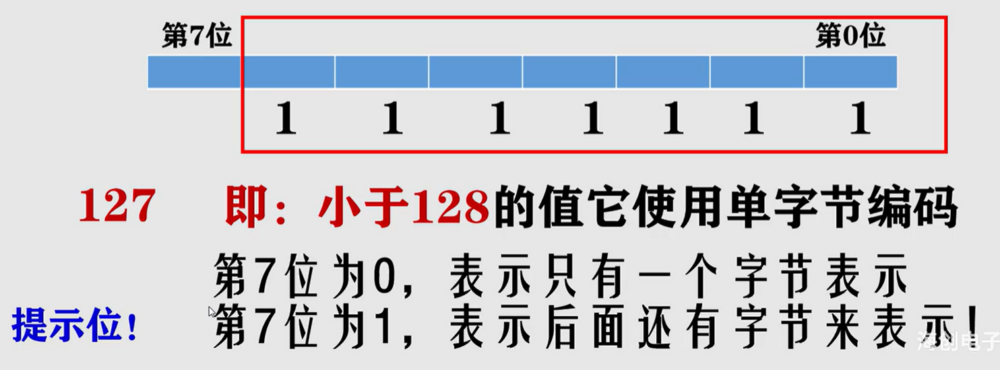   
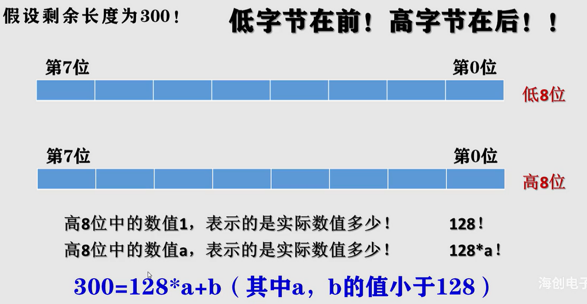     
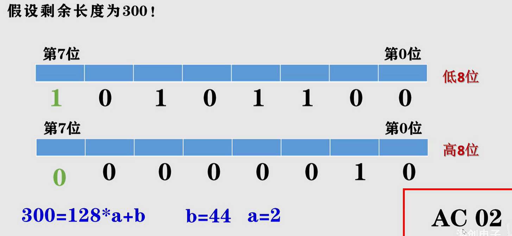   
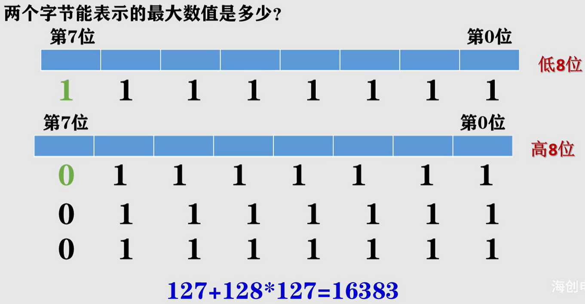   
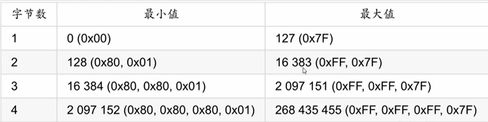     
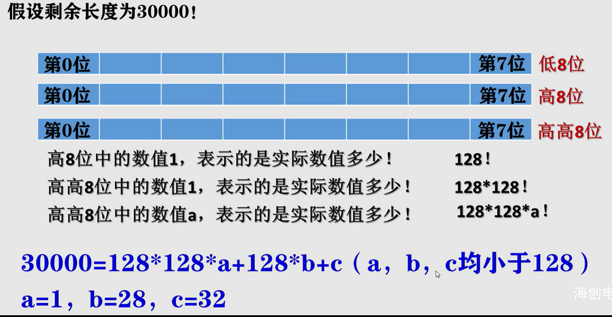   
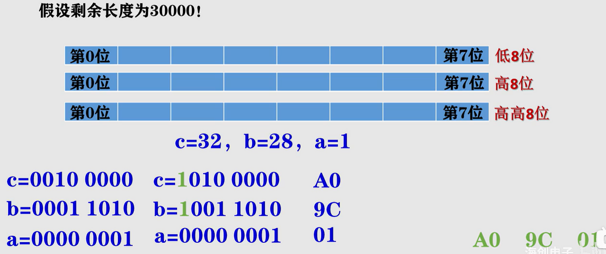


# 一. mqtt说明
## 1.1 配置说明

**访问emqt的web管理页面**
http://127.0.0.1:18083
#账号： admin
#密码: public

**端口**
1883：MQTT 协议端口
8084：MQTT/SSL 端口
8083：MQTT/WebSocket 端口
8080：HTTP API 端口
18083：Dashboard 管理控制台端口

# 二. 内部模块划分
## 2.1 mqtt-boot
+ 消费订阅消息
只要实现了`com.zjut.study.mqtt.boot.config.handle.MessageConsumer`接口并注入到spring容器即可，如`com.zjut.study.mqtt.boot.consumer.TopicMqttBootUpConsumer`


