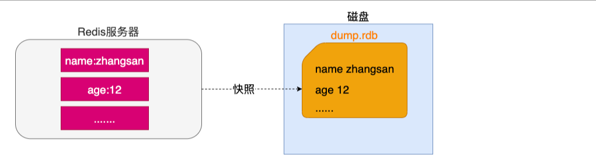
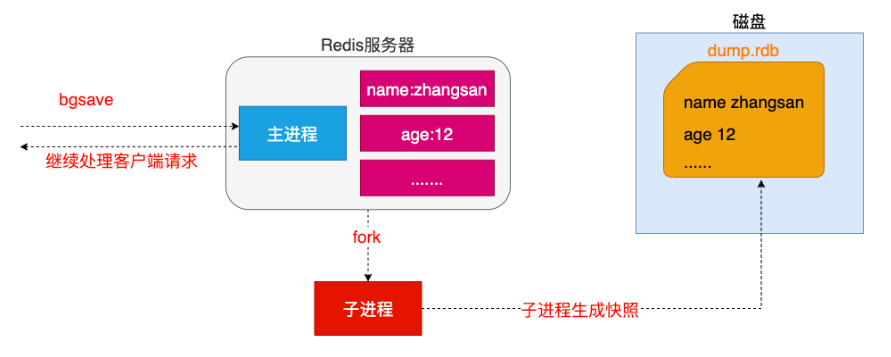
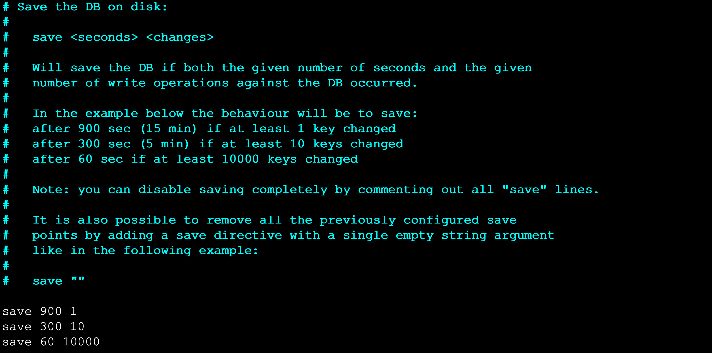
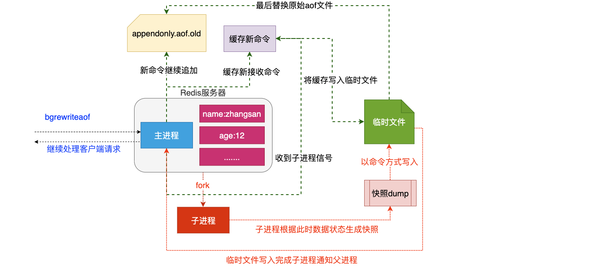

# 持久化
## 快照
**特点**  
以.rdb作为后缀的文件将某一时刻的所有数据都写入硬盘中   


**生成方式**  
+ 客户端方式: BGSAVE 和 SAVE指令
+ 服务器配置自动触发
```
# 1.客户端方式之BGSAVE
- a.客户端可以使用BGSAVE命令来创建一个快照,当接收到客户端的BGSAVE命令时,redis会调用fork¹来创建一个子进程,然后子进程负责将快照写入磁盘中,而父进程则继续处理命令请求。
	`名词解释: fork当一个进程创建子进程的时候,底层的操作系统会创建该进程的一个副本,在类unix系统中创建子进程的操作会进行优化:在刚开始的时候,父子进程共享相同内存,直到父进程或子进程对内存进行了写之后,对被写入的内存的共享才会结束服务`

# 2.客户端方式之SAVE
- b.客户端还可以使用SAVE命令来创建一个快照,接收到SAVE命令的redis服务器在快照创建完毕之前将不再响应任何其他的命令

# 3.服务器配置方式之满足配置自动触发
- 如果用户在redis.conf中设置了save配置选项,redis会在save选项条件满足之后自动触发一次BGSAVE命令,如果设置多个save配置选项,当任意一个save配置选项条件满足,redis也会触发一次BGSAVE命令

# 4.服务器接收客户端shutdown指令
- 当redis通过shutdown指令接收到关闭服务器的请求时,会执行一个save命令,阻塞所有的客户端,不再执行客户端执行发送的任何命令,并且在save命令执行完毕之后关闭服务器
- shutdown 命令
- 停止所有客户端
- 如果有至少一个保存点在等待，执行 SAVE 命令
- 如果 AOF 选项被打开，更新 AOF 文件
- 关闭 redis 服务器(server)
```
  
注意: SAVE命令并不常用,使用SAVE命令在快照创建完毕之前,redis处于阻塞状态,无法对外服务  



## AOF
**服务端配置AOF方式持久化策略：**
```
# 1.always 【谨慎使用】
- 说明: 每个redis写命令都要同步写入硬盘,严重降低redis速度
- 解释: 如果用户使用了always选项,那么每个redis写命令都会被写入硬盘,从而将发生系统崩溃时出现的数据丢失减到最少;遗憾的是,因为这种同步策略需要对硬盘进行大量的写入操作,所以redis处理命令的速度会受到硬盘性能的限制;
- 注意: 转盘式硬盘在这种频率下200左右个命令/s ; 固态硬盘(SSD) 几百万个命令/s;
- 警告: 使用SSD用户请谨慎使用always选项,这种模式不断写入少量数据的做法有可能会引发严重的写入放大问题,导致将固态硬盘的寿命从原来的几年降低为几个月。

# 2.everysec 【推荐】
- 说明: 每秒执行一次同步显式的将多个写命令同步到磁盘
- 解释： 为了兼顾数据安全和写入性能,用户可以考虑使用everysec选项,让redis每秒一次的频率对AOF文件进行同步;redis每秒同步一次AOF文件时性能和不使用任何持久化特性时的性能相差无几,而通过每秒同步一次AOF文件,redis可以保证,即使系统崩溃,用户最多丢失一秒之内产生的数据。

# 3.no	【不推荐】
- 说明: 由操作系统决定何时同步 
- 如果设置为no，则write后不会有fsync调用，由操作系统自动调度刷磁盘，性能是最好的。

- 解释：最后使用no选项,将完全有操作系统决定什么时候同步AOF日志文件,这个选项不会对redis性能带来影响但是系统崩溃时,会丢失不定数量的数据,另外如果用户硬盘处理写入操作不够快的话,当缓冲区被等待写入硬盘数据填满时,redis会处于阻塞状态,并导致redis的处理命令请求的速度变慢。
```

**AOF重写：**    
持久化文件会变的越来越大。例如我们调用incr test命令100次，文件中必须保存全部的100条命令，其实有99条都是多余的。因为要恢复数据库的状态其实文件中保存一条set test 100就够了。为了压缩aof的持久化文件Redis提供了AOF重写(ReWriter)机制。用来在一定程度上减小AOF文件的体积

触发重写方式:
```
# 1.客户端方式触发重写
- 执行BGREWRITEAOF命令  不会阻塞redis的服务

# 2.服务器配置方式自动触发
- 配置redis.conf中的auto-aof-rewrite-percentage选项 参加下图↓↓↓
- 如果设置auto-aof-rewrite-percentage值为100和auto-aof-rewrite-min-size 64mb,并且启用的AOF持久化时,那么当AOF文件体积大于64M,并且AOF文件的体积比上一次重写之后体积大了至少一倍(100%)时,会自动触发,如果重写过于频繁,用户可以考虑将auto-aof-rewrite-percentage设置为更大
```
重写原理
Redis将使用与快照类似的方式将内存中的数据以命令的方式保存到临时文件中，最后替换原来的文件，以此来实现控制AOF文件的合并重写（会将重写过程中接收的的新的指令和生成新的重写后AOF文件中的指令进行合并）。

注意:在重写AOF文件时并没有读取旧的AOF文件，而是将整个内存中的数据库内容用命令的方式重写了一个新的AOF文件 （模拟快照的过程）
```
# 重写流程
- 1. redis调用fork ，现在有父子两个进程 子进程根据内存中的数据库快照，往临时文件中写入重建数据库状态的命令
- 2. 父进程继续处理client请求，除了把写命令写入到原来的aof文件中。同时把收到的写命令缓存起来。这样就能保证如果子进程重写失败的话并不会出问题。
- 3. 当子进程把快照内容写入已命令方式写到临时文件中后，子进程发信号通知父进程。然后父进程把缓存的写命令也写入到临时文件。
- 4. 现在父进程可以使用临时文件替换老的aof文件，并重命名，后面收到的写命令也开始往新的aof文件中追加。
```

