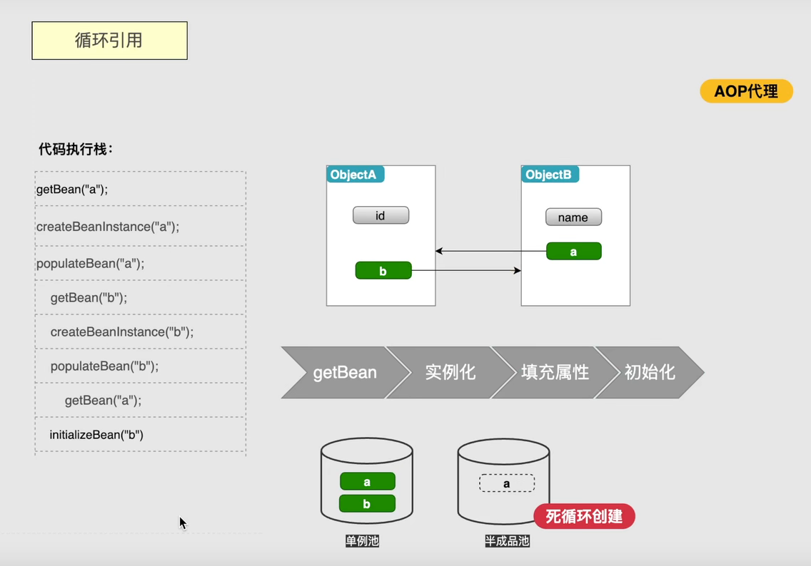
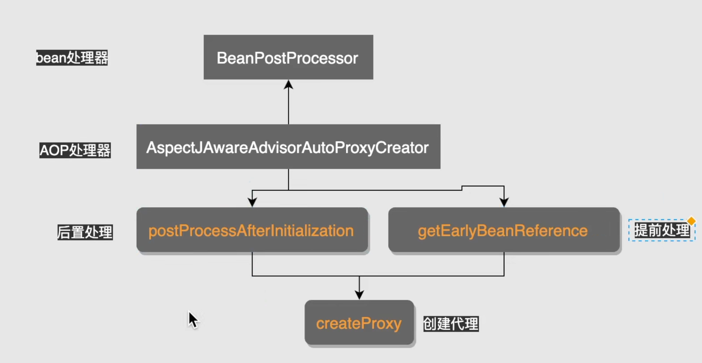
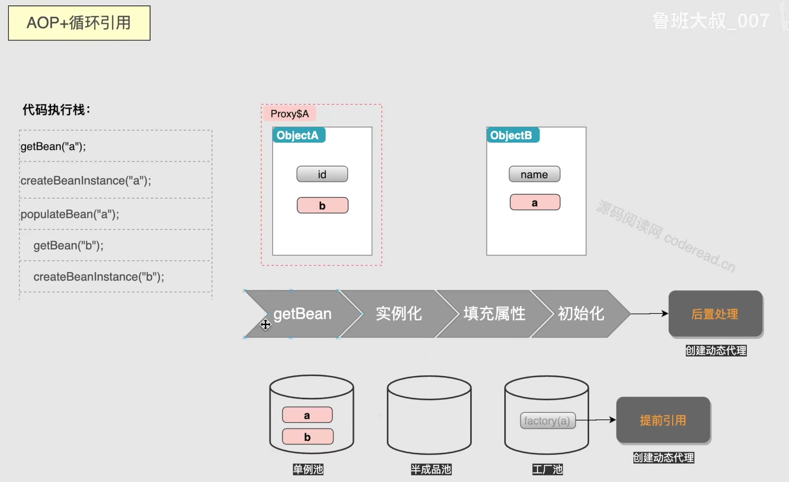
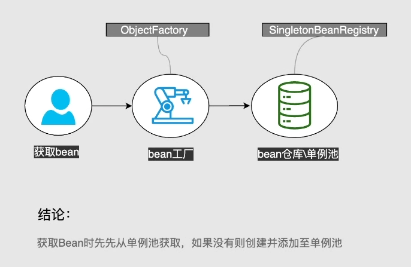
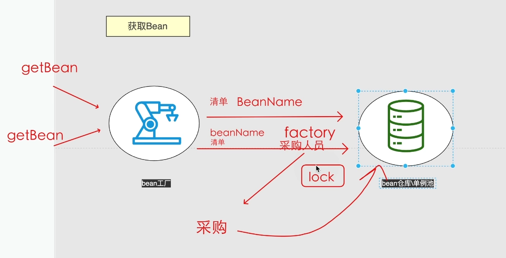
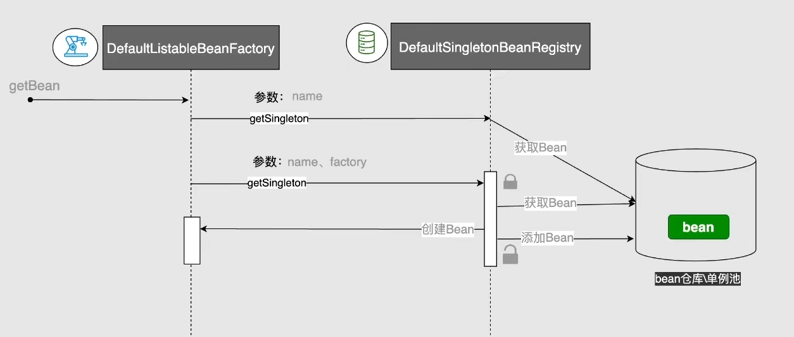
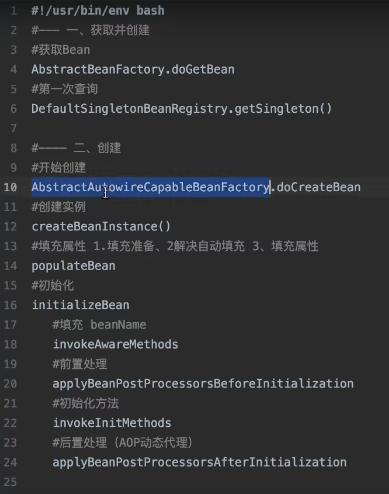

# 一. 循环依赖
二级缓存能够解决循环引用，但是二级缓存不能解决aop动态代理，所以需要引入三级缓存解决aop（初始化后阶段）
  
getBean("a"),实例化A(并将自己放到半成品池子)，填充A属性，需要注入B，getBean("b")，实例化B，填充B属性，需要注入A，从单例池或半成品池查找A，初始化B，将B放入单例池，完成A的初始化  
   
   
getBean("a"),实例化A(创建A的bean工厂放到工厂池)，填充A属性，需要注入B，getBean("b")，实例化B(创建一个B的bean工厂放入到工厂池)，填充B属性，需要注入A，从工厂池中用A的bean工厂用提起引用创建一个A的半成品代理对象放入到半成品池，初始化B，后置处理创建B的代理对象注入到A属性并添加到单例池，因为B不需要用到工厂池所以从工厂池中删除，完成A的初始化，A的
后置处理，删除工厂池中的A   

   
   
   

   
