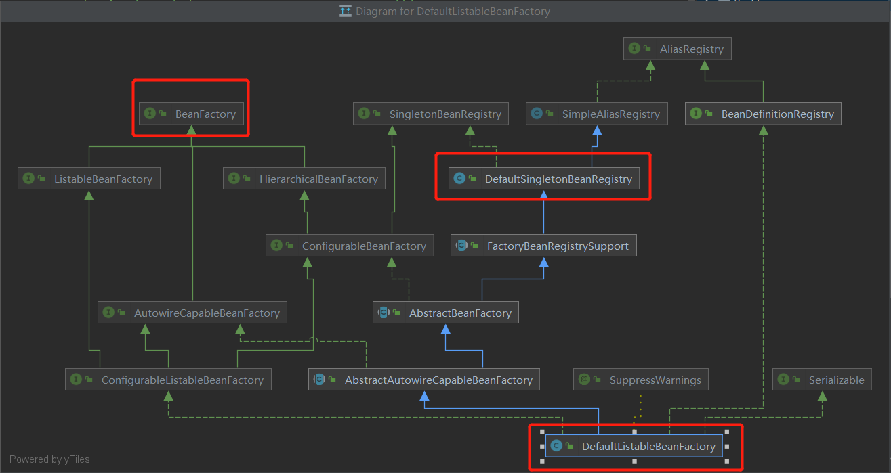

[toc]

# 一. 项目结构说明
工程构建：
+ exception 异常

功能扩展：
+ controller 对外提供接口
+ aware  aware扩展   
+ cycledependency 循环依赖
+ validate 入参校验
+ beanfactory spring上下文

# 二. 功能模块
## 2.1 入参校验
+ controller层校验
+ service层校验(同时提供给controller和dubbo接口做共同的校验)

## 2.2 [BeanFactory](src/main/java/com/zjut/study/boot/beanfactory)
  

